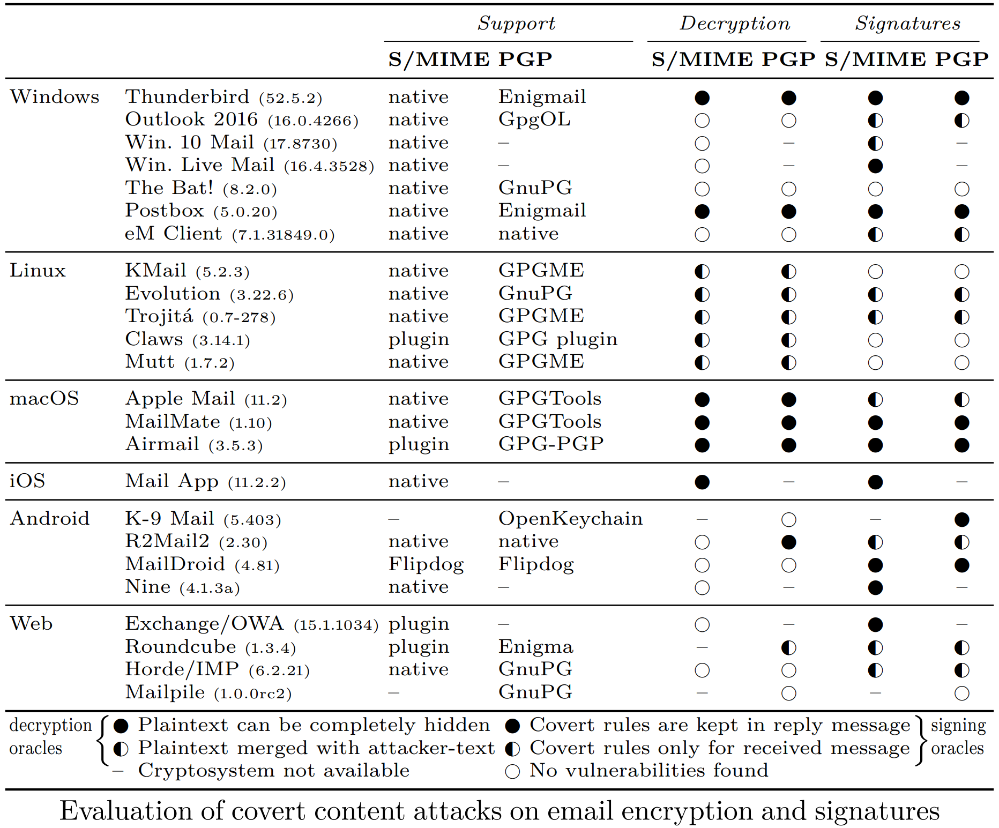

# Re: What's up Johnny?
Artifacts for the DEF CON talk | draft paper [here](https://arxiv.org/abs/1904.07550)

### Abstract

We show practical attacks against OpenPGP and S/MIME encryption and digital signatures in the context of email. Instead of targeting the underlying cryptographic primitives, our attacks abuse legitimate features of the MIME standard and HTML, as supported by email clients, to deceive the user regarding the actual message content. We demonstrate how the attacker can unknowingly abuse the user as a decryption oracle by replying to an unsuspicious looking email. Using this technique, the plaintext of hundreds of encrypted emails can be leaked at once. Furthermore, we show how users could be tricked into signing arbitrary text by replying to emails containing CSS conditional rules. An evaluation shows that 17 out of 19 OpenPGP-capable email clients, as well as 21 out of 22 clients supporting S/MIME, are vulnerable to at least one attack. We provide different countermeasures and discuss their advantages and disadvantages.

### Usage

1. Import the S/MIME and PGP [secret keys](assets/secret-keys) into your email client
2. Before continuing, verify that you can sucessfully decrypt...
  * `tests/pgp_mime/00-original-mail.eml`
  * `tests/smime/00-original-mail.eml`
  * `tests/pgp_inline/00-original-mail.eml`
3. Move the .eml file to your inbox (e.g. drag-and-drop in Thunderbird)
4. Do the modified multipart messages in `test/` still decrypt?
  * If so, are they included in reply messages? Can you hide them?

### Evaluation

