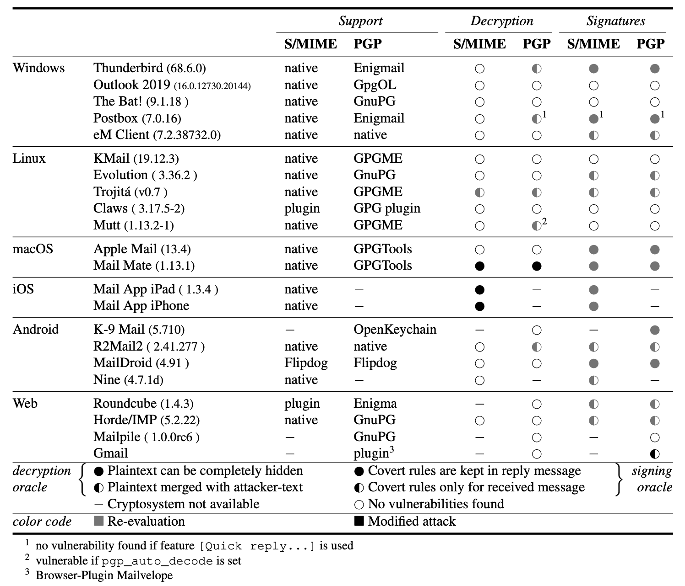

# Re-evaluation of Covert-Content-Attacks 

Artifacts for the thesis "Re-Evaluation von Angriffen auf E-Mail-Verschlüsselungen und E-Mail-Signaturen" by Heike Knobbe.

## Abstract

In the year 2019 Müller, Brinkmann, Poddebniak, Schinzel and Schwenk published the paper [„Re: What’s Up Johnny?“](https://arxiv.org/pdf/1904.07550.pdf). They introduce covert content attacks against OpenPGP and S/MIME encryption and signatures in the context of e-mail. The attacks use the reply function of the E-Mail-Client as a backchannel. 

In doing so, properties of the MIME standard and HTML/CSS properties are misused to deceive the user about the actual content of the e-mail. The first category of attack, the _Decryption Oracle_, aims to extract the decrypted plaintext via the backchannel without the user noticing. The second category, _Signing Oracle_, shows how users can be tricked into signing arbitrary text by replying to manipulated e-mails. In the context of a benign looking e-mail to the victim, this arbitrary text is hidden by CSS conditional rules.

About two years have passed since the tests were conducted. In the present thesis, a re-evaluation of these attacks was carried out. First of all, it was checked whether the proof-of-concept attacks are still possible. Depending on the results of the re-evaluation, the countermeasures taken by the vendors were examined. Finally, targeted modifications of the attacks were made to circumvent the countermeasures. 

## Re-evaluation

